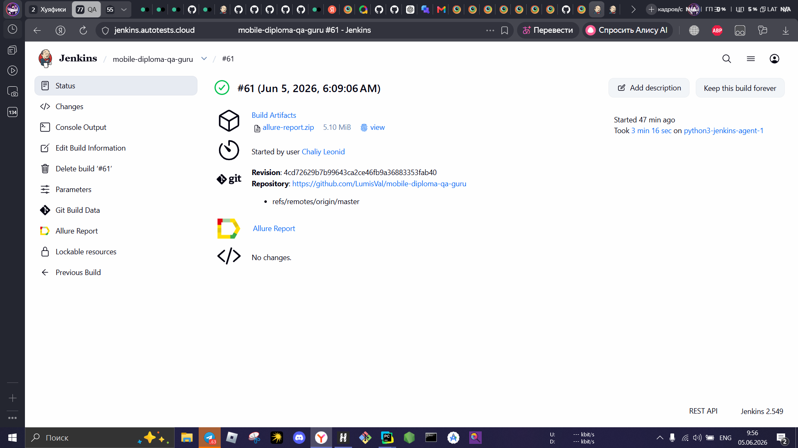
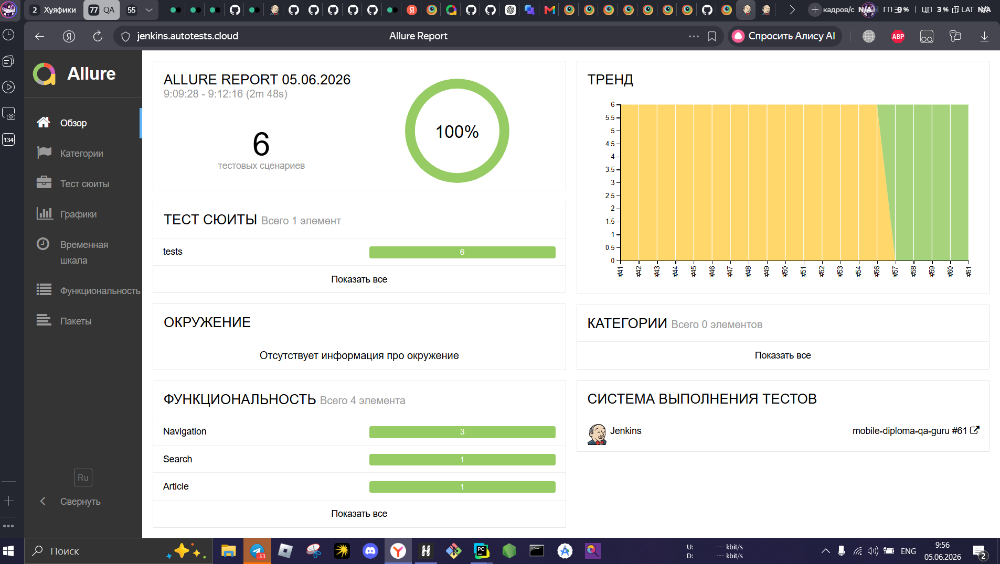
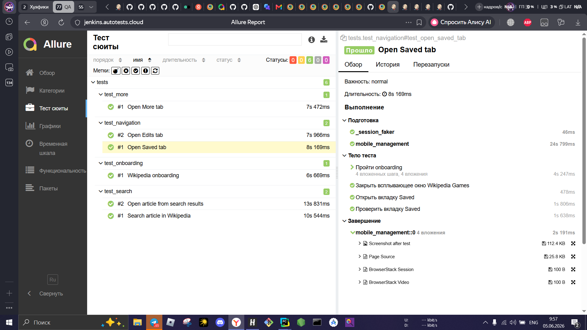
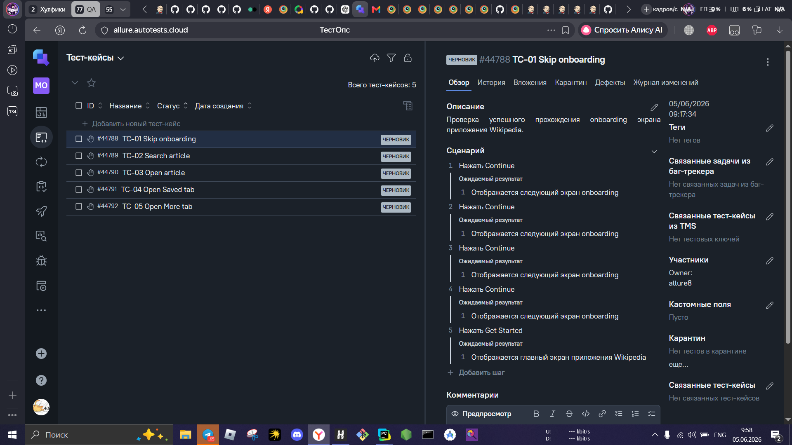
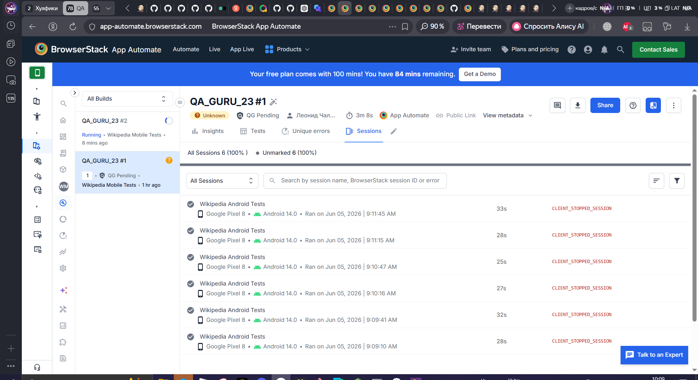

# 📱 Mobile-автотесты: Wikipedia для Android


Автотесты Android-приложения [Wikipedia](https://github.com/wikimedia/apps-android-wikipedia) (alpha-сборка). Итоговый проект курса QA.GURU по автоматизации на Python.

## 🛠 Стек

| Инструмент | Для чего |
|---|---|
| Python 3.12, Pytest | язык и запуск тестов |
| Appium + UiAutomator2 | управление Android-приложением |
| Selene | удобная обёртка над драйвером: ожидания, проверки |
| pydantic-settings, python-dotenv | конфигурация окружений через `.env`-файлы |
| Allure Report / Allure TestOps | отчёты и ручные тест-кейсы |
| BrowserStack | запуск на реальных устройствах в облаке |
| Jenkins | удалённый запуск |

Архитектура — **Page Object**: каждый экран приложения описан отдельным классом в `pages/`, тесты в `tests/` только вызывают его методы.

## 🎯 Что проверяется

| Тест | Что делает |
|---|---|
| `test_onboarding` | проходит 4 экрана онбординга и проверяет заголовок каждого |
| `test_search_article` | ищет «Python» и проверяет, что в результатах есть статья о языке программирования |
| `test_open_article_from_search_results` | открывает статью «Python (programming language)» из результатов и проверяет её заголовок |
| `test_open_saved_tab` | открывает вкладку Saved |
| `test_open_activity_tab` | открывает вкладку Activity и проверяет экран «Introducing Activity» |
| `test_open_more_tab` | открывает вкладку More и проверяет пункт Settings |

После каждого теста в Allure прикладываются скриншот и XML-разметка экрана, при запуске в BrowserStack — ещё видео и ссылка на сессию.

## 🔍 Интересные решения

- **Локаторы без `resource-id`.** В актуальной версии приложения онбординг переписан на Jetpack Compose, и у элементов нет `id`. Кнопки ищутся по accessibility id (`content-desc`), заголовки — по тексту.
- **Промо-панель с анимацией.** После первого открытия поиска выезжает панель «A Faster way to Search». Тест ждёт её до 3 секунд и закрывает, если она появилась; мгновенная проверка тут давала нестабильные падения.
- **Результат поиска выбирается по названию.** Первым результатом по запросу «Python» идёт страница неоднозначности, поэтому тест кликает по точному названию статьи, а не по первому элементу списка.
- **Проверки по уникальным элементам экрана.** Например, для Activity проверяется заголовок «Introducing Activity», который есть только на открытом экране, а не надпись на нижней вкладке.

## 📂 Структура

```text
mobile-diploma-qa-guru
├── config/
│   ├── context.py        # выбор окружения по переменной CONTEXT
│   └── settings.py       # настройки из .env-файлов
├── pages/
│   ├── onboarding_page.py
│   ├── main_page.py
│   ├── search_page.py
│   └── article_page.py
├── tests/
│   ├── test_onboarding.py
│   ├── test_search.py
│   ├── test_navigation.py
│   └── test_more.py
├── utils/attachments.py  # скриншоты, page source, видео для Allure
├── .env.bstack           # BrowserStack
├── .env.local_emulator   # локальный эмулятор
├── .env.local_real       # реальное устройство по USB
├── conftest.py
└── requirements.txt
```

## 🚀 Запуск

### Подготовка

```bash
python -m venv .venv
.venv\Scripts\activate          # Windows; на macOS/Linux: source .venv/bin/activate
pip install -r requirements.txt
```

### Локально на эмуляторе

1. Скачайте APK [app-alpha-universal-release.apk](https://github.com/wikimedia/apps-android-wikipedia/releases/download/latest/app-alpha-universal-release.apk) и положите в папку `app/` (она в `.gitignore`).
2. Запустите эмулятор Android и проверьте, что версия Android совпадает с `PLATFORM_VERSION` в `.env.local_emulator`.
3. Запустите Appium-сервер: `appium`.
4. Запустите тесты:

```powershell
# Windows PowerShell
$env:CONTEXT = "local_emulator"
pytest tests -v
```

```bash
# macOS / Linux
CONTEXT=local_emulator pytest tests -v
```

### В BrowserStack

Создайте рядом с проектом файл `.env.credentials` (он в `.gitignore`, в репозиторий не попадает):

```
BROWSERSTACK_USER=ваш_логин
BROWSERSTACK_KEY=ваш_ключ
```

Загрузите APK в BrowserStack, подставьте полученный `bs://...` в `ANDROID_APP` в `.env.bstack` и запустите:

```bash
CONTEXT=bstack pytest tests -v
```

### Allure-отчёт

```bash
allure serve allure-results
```

## ⚙️ Jenkins



## 📊 Allure Report





## 📝 Allure TestOps

Ручные тест-кейсы ведутся в Allure TestOps.



## ☁️ BrowserStack



## 🔧 Что можно улучшить

- сделать проверку вкладки Saved по элементу, который есть только на открытом экране;
- добавить запуск тестов в GitHub Actions;
- вынести локаторы в константы, чтобы при следующем обновлении приложения менять их в одном месте.

## 👨‍💻 Автор

**Леонид Чалый** — Junior QA Engineer · [GitHub](https://github.com/LumisVal) · Telegram [@ChAi_s_Lim0nom](https://t.me/ChAi_s_Lim0nom)